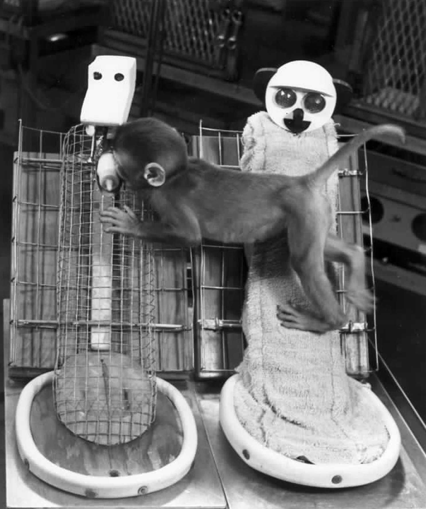
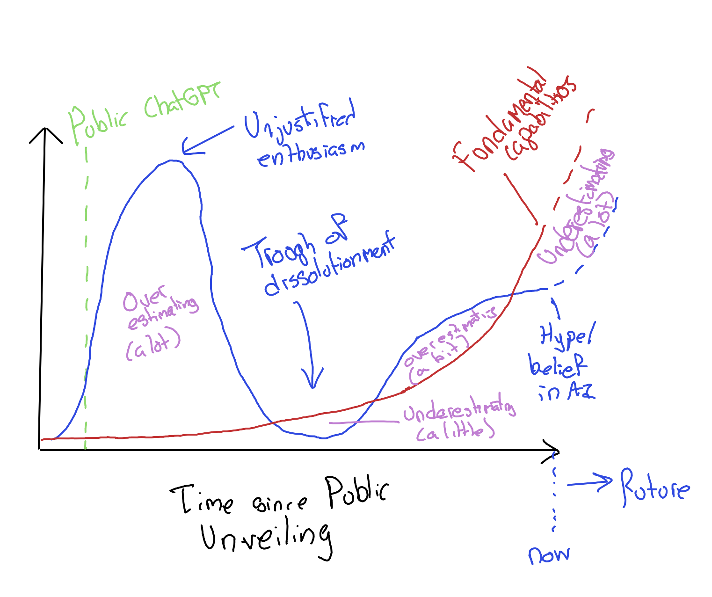

## Welcome {.center}

**Edinburgh Humanists**

4 May 2026

*Artificial Intelligence: From Hype and Fear to Hope and Possibility*

---

## A fair starting point {.smaller}

If you came in sceptical about AI, you are in good company.

- The hype has been extraordinary.
- The share prices have been extraordinary.
- Chatbots remain confidently wrong with some regularity.

This talk will not ask you to stop being sceptical. It will ask you to be sceptical about *different things* than you were a year ago.

---

## About me {.smaller}

Jon Minton

- Data scientist and statistician in Edinburgh.
- Background spans demography, sociology and software development.
- Humanist — and, until late 2025, a reasonably confident AI sceptic.
- [GitHub](https://github.com/JonMinton) · [Blog](https://jonminton.github.io/jon-blog/)

---

# Part 1 · My pivot {.center}

How a sceptic changed his mind in late 2025

---

## Two years of shrug {.smaller}

From ChatGPT's release in late 2022 to summer 2025, my honest view was:

> Impressive party trick. Often wrong. Not obviously transformative.

I watched the hype, watched the dissolution, and was comfortable filing the whole thing under *over-promised, under-delivered*.

Then, in a few months, three things happened.

---

## Trigger 1 · A documentary {.smaller}

:::: {.columns}
::: {.column width="55%"}
**The Thinking Game** (2024)

A documentary about **Demis Hassabis** and DeepMind — not Sam Altman, not OpenAI.

A quieter AI story: protein folding, neuroscience, decades of patient work.

It is free on YouTube. If you watch only one thing after this talk, watch this.
:::
::: {.column width="45%"}
{width=90%}
:::
::::

---

## Trigger 2 · An argument in a park {.smaller}

I took a baked potato to the Meadows and, idly, asked Claude — Anthropic's chatbot — what it thought about the ethics of eating animals.

I expected agreement. What I got was pushback: careful, specific, and better-argued than I had reckoned on.

I had met something I did not know AI could be: *a dialectical engine*.

---

## Trigger 3 · A speed-up {.smaller}

I tried **Claude Code** — an "agentic" tool that writes software on your behalf.

On tasks with *verifiable* outputs (does the code run? does the test pass?) it compressed days of work into hours.

This is not "a chatbot hallucinates". This is something new. We will come back to what "agentic" means.

---

## Where we are going {.smaller}

1. **AI ≠ ChatGPT** — a longer, stranger history.
2. **The quiet capability ramp** — what "agentic AI" actually does.
3. **Why it doesn't feel transformative yet** — the valley of death.
4. **Risks and hopes** — labour, inequality, science, self.
5. **A coda** — one positive imaginary, borrowed from fiction.

---

# Part 2 · AI is older and stranger than ChatGPT {.center}

---

## An experiment in comfort {.smaller}

:::: {.columns}
::: {.column width="55%"}
**Harry Harlow, 1950s.** Infant rhesus monkeys were offered two surrogate "mothers":

- A **wire mother** that dispensed milk.
- A **cloth mother** that did not.

The monkeys drank from wire and clung to cloth. Comfort and function came apart.

*(The experiments were, by modern standards, cruel. The finding was important.)*
:::
::: {.column width="45%"}
{width=95%}
:::
::::

---

## Two traditions of AI {.smaller}

For most of its history, AI has split along the same line.

:::: {.columns}
::: {.column width="50%"}
**Wire-mother AI**

Function first.

Games. Protein folding. Diagnosis. Logistics.

Less fluent, more useful.

Mostly **DeepMind** and its ancestors.
:::
::: {.column width="50%"}
**Cloth-mother AI**

Conversation first.

Fluency. Companionship. Prose.

More charming, more confidently wrong.

Mostly **OpenAI** and its imitators.
:::
::::

---

## The loud faces {.smaller}

:::: {.columns}
::: {.column width="50%"}
{width=80%}

**Sam Altman**
:::
::: {.column width="50%"}
> **TODO:** sourced portrait of **Elon Musk (xAI)** — cc-licensed or public-domain.

**Elon Musk**
:::
::::

If you have only heard of two AI figures, it is almost certainly these two.

Their companies are valuable. Their public personas are loud. Their products have shipped.

They are not the whole field.

---

## The quieter builders {.smaller}

:::: {.columns}
::: {.column width="50%"}
{width=80%}

**Demis Hassabis** — neuroscientist, chess prodigy, games designer. Nobel Prize in Chemistry, 2024, for AlphaFold.
:::
::: {.column width="50%"}
> **TODO:** sourced portrait of **Dario Amodei (Anthropic)** — cc-licensed or public-domain.

**Dario Amodei** — physicist by training. Left OpenAI over safety disagreements to co-found Anthropic, the makers of Claude.
:::
::::

If you want to understand where AI is going, these are the people to read.

---

## What AlphaFold actually did {.smaller}

:::: {.columns}
::: {.column width="55%"}
A 50-year-old open problem in biology: given a protein's amino-acid sequence, predict the 3D shape it folds into.

DeepMind's **AlphaFold** (2020) solved it well enough to be useful.

By 2024 the method had catalogued ≈200 million protein structures — a once-in-a-generation gift to biology, medicine, and drug discovery.

The 2024 Nobel Prize in Chemistry followed.
:::
::: {.column width="45%"}
{width=95%}
:::
::::

This is the AI story that ought to have led the news. It mostly did not.

---

## Hype and capability have come apart {.smaller}

{width=70%}

Public hype peaked, crashed, and has been flat.

Capability has quietly kept climbing.

The gap between the two is where this talk lives.

---

## A handover {.smaller}

So: AI is older than ChatGPT, stranger than ChatGPT, and — in the hands of its quieter builders — considerably more interesting than ChatGPT.

Next: what has been climbing quietly, and what "**agentic**" means in practice.

<!--
  §3 (Quiet capability ramp) drafted next session.
  librarything-valuator demo lands here.
-->
