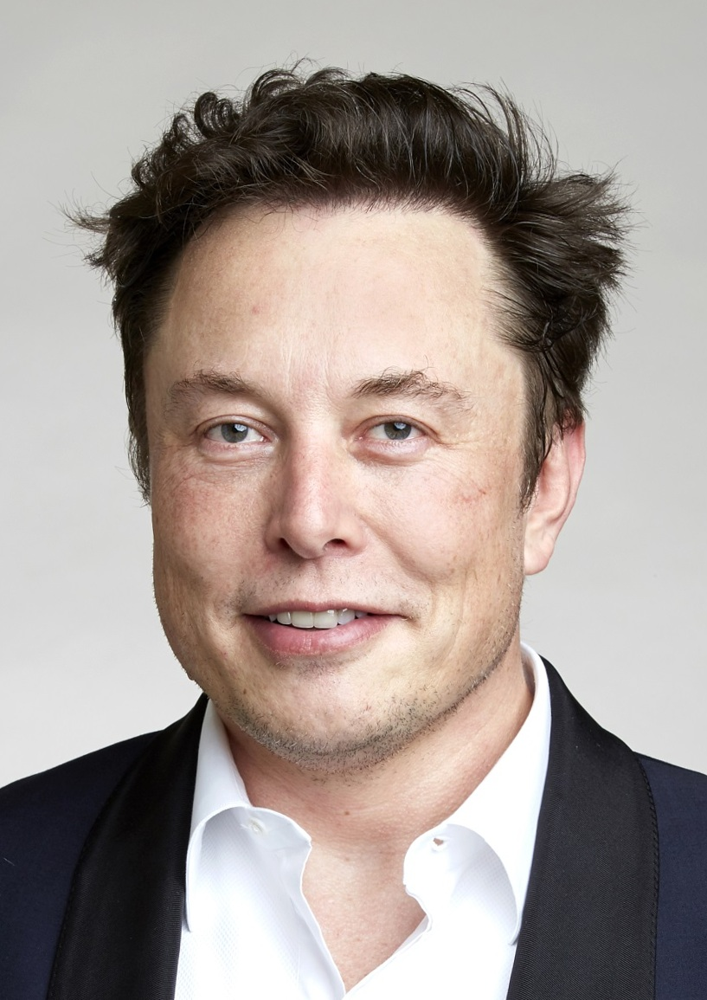

## Welcome {.center}

**Edinburgh Humanists**

4 May 2026

*Artificial Intelligence: From Hype and Fear to Hope and Possibility*

---

## A fair starting point {.smaller}

If you came in sceptical about AI, you are in good company.

- The hype has been extraordinary.
- The share prices have been extraordinary.
- Chatbots remain confidently wrong with some regularity.

This talk will not ask you to stop being sceptical. It will ask you to be sceptical about *different things* than you were a year ago.

---

## About me {.smaller}

Jon Minton

- Data scientist and statistician in Edinburgh.
- Background spans demography, sociology and software development.
- Humanist — and, until late 2025, not engaged enough with AI to hold a strong view. A disengaged sceptic, at most.
- [GitHub](https://github.com/JonMinton) · [Blog](https://jonminton.github.io/jon-blog/)

---

# Part 1 · My pivot {.center}

How a disengaged sceptic started paying attention

---

## Two years of shrug {.smaller}

From ChatGPT's release in late 2022 to summer 2025, I did not pay close attention. From the distance I kept, the field looked like:

> Impressive party trick. Often wrong. Not obviously transformative.

That was enough to keep me from engaging — it was not enough to make me a committed sceptic. I had filed the whole thing under *over-promised, under-delivered* and moved on.

Then, in a few months, three things happened.

---

## Trigger 1 · A documentary {.smaller}

:::: {.columns}
::: {.column width="55%"}
**The Thinking Game** (2024)

A documentary about **Demis Hassabis** and DeepMind — not Sam Altman, not OpenAI.

A quieter AI story: protein folding, neuroscience, decades of patient work.

It is free on YouTube. If you watch only one thing after this talk, watch this.
:::
::: {.column width="45%"}
{width=90%}
:::
::::

---

## Trigger 2 · An argument in a park {.smaller}

I took a baked potato to the Meadows and, idly, asked Claude — Anthropic's chatbot — what it thought about the ethics of eating animals.

I expected agreement. What I got was pushback: careful, specific, and better-argued than I had reckoned on.

I had met something I did not know AI could be: *a dialectical engine*.

---

## Trigger 3 · A speed-up {.smaller}

I tried **Claude Code** — an "agentic" tool that writes software on your behalf.

On tasks with *verifiable* outputs (does the code run? does the test pass?) it compressed days of work into hours.

This is not "a chatbot hallucinates". This is something new. We will come back to what "agentic" means.

---

## Where we are going {.smaller}

1. **AI ≠ ChatGPT** — a longer, stranger history.
2. **The quiet capability ramp** — what "agentic AI" actually does.
3. **Why it doesn't feel transformative yet** — the valley of death.
4. **Risks and hopes** — labour, inequality, science, self.
5. **A coda** — one positive imaginary, borrowed from fiction.

---

# Part 2 · AI is older and stranger than ChatGPT {.center}

---

## An experiment in comfort {.smaller}

:::: {.columns}
::: {.column width="55%"}
**Harry Harlow, 1950s.** Infant rhesus monkeys were offered two surrogate "mothers":

- A **wire mother** that dispensed milk.
- A **cloth mother** that did not.

The monkeys drank from wire and clung to cloth. Comfort and function came apart.

*(The experiments were, by modern standards, cruel. The finding was important.)*
:::
::: {.column width="45%"}
{width=95%}
:::
::::

---

## Two traditions of AI {.smaller}

For most of its history, AI has split along the same line.

:::: {.columns}
::: {.column width="50%"}
**Wire-mother AI**

Function first.

Games. Protein folding. Diagnosis. Logistics.

Less fluent, more useful.

Mostly **DeepMind** and its ancestors.
:::
::: {.column width="50%"}
**Cloth-mother AI**

Conversation first.

Fluency. Companionship. Prose.

More charming, more confidently wrong.

Mostly **OpenAI** and its imitators.
:::
::::

---

## Why games? {.smaller}

DeepMind started with chess, Go, and old Atari titles — not by accident.

A game has an **objective loss function**: the environment tells you, without flattery, whether you won or lost.

An AI trained against ground truth gets better at *being right*. Repeatedly. Relentlessly. With no room to bluff.

AlphaFold works for the same reason: a protein structure can be measured. Predictions can be wrong. Wrongness can be punished. The system learns.

---

## And without a loss function? {.smaller}

Large language models, once pre-trained, are aligned using **human preference** — a technique known as **RLHF** (reinforcement learning from human feedback).

They learn to produce *responses humans prefer* — which turns out to reward:

- Fluency over accuracy.
- Confidence over circumspection.
- Agreement over challenge.

The symptoms are familiar: **hallucinations, sycophancy, confidently wrong answers.**

These are not bugs in the training data. They are consequences of the training signal.

---

## Downing Street, May 2023 {.smaller}

{width=78%}

When the British Prime Minister wanted the serious AI conversation of 2023, he invited three people.

---

## Three builders {.smaller}

- **Demis Hassabis** — neuroscientist, chess prodigy, games designer. Founded DeepMind. Nobel Prize in Chemistry, 2024, for AlphaFold.
- **Dario Amodei** — physicist by training. Left OpenAI over safety disagreements to co-found **Anthropic**, the makers of Claude.
- **Sam Altman** — founder-CEO of OpenAI. A builder *and* the most recognisable public face of AI.

Different personalities. One common fact: they build.

---

## The one who wasn't {.smaller}

:::: {.columns}
::: {.column width="45%"}
{width=90%}
:::
::: {.column width="55%"}
**Elon Musk** was running xAI. He was not in the room.

xAI has substantial resources. It has not, so far, featured in the serious AI conversation the way the other three companies have.

The public faces of AI are not quite who the headlines suggest.
:::
::::

---

## Where this leaves the field {.smaller}

Four figures. Three distinct modes:

- **Hassabis** and **Amodei** — quieter builders. Research-first, safety-vocal. The people to read if you want to understand where AI is going.
- **Altman** — builder *and* louder figurehead. Serious enough to be at Downing Street; also reliably in the news.
- **Musk** — louder still. Increasingly *figurehead*, decreasingly *builder*.

Watch the last two if you want the public conversation. Read the first two if you want the work.

---

## What AlphaFold actually did {.smaller}

:::: {.columns}
::: {.column width="55%"}
A 50-year-old open problem in biology: given a protein's amino-acid sequence, predict the 3D shape it folds into.

DeepMind's **AlphaFold** (2020) solved it well enough to be useful.

By 2024 the method had catalogued ≈200 million protein structures — a once-in-a-generation gift to biology, medicine, and drug discovery.

The 2024 Nobel Prize in Chemistry followed.
:::
::: {.column width="45%"}
{width=95%}
:::
::::

This is the AI story that ought to have led the news. It mostly did not.

---

## Hype and capability have come apart {.smaller}

{width=70%}

Public hype peaked, crashed, and has been flat.

Capability has quietly kept climbing.

The gap between the two is where this talk lives.

---

## A handover {.smaller}

So: AI is older than ChatGPT, stranger than ChatGPT, and — in the hands of its quieter builders — considerably more interesting than ChatGPT.

Next: what has been climbing quietly, and what "**agentic**" means in practice.

# Part 3 · The quiet capability ramp {.center}

What "agentic AI" actually means

---

## "Agentic" in plain language {.smaller}

A chatbot answers a question.

An **agent** does a job.

Concretely: an AI that can read files, run tools, write and test its own code, check whether the result is correct, and iterate — without asking permission between each step.

The word is new. The behaviour is newer still.

---

## What changed in 2025 {.smaller}

Three capability jumps, quiet in the press, large in effect:

1. **Long-horizon work.** Models can now keep a task in mind across hours of activity, not seconds of chat.
2. **Tool use.** They can reach outside themselves — into files, databases, the web, your code — and act.
3. **Self-correction.** When a test fails, they try again. When evidence contradicts them, they update.

None of this is AGI. All of it is genuinely new.

---

## Ground truth, re-introduced {.smaller}

This is also the deeper reason agentic AI feels different from a chatbot.

When an agent can *run* the code, *read* the file, *query* the database — it gets a **ground-truth signal back**, the same way AlphaFold does. The world pushes back.

The LLM underneath still bluffs. The agentic loop around it does not have to.

This is why the first big speed-ups have landed in tasks with **verifiable outputs**: software, maths, scientific workflows. Anywhere wrongness can be punished, agents get better. Anywhere it cannot, they remain fluent and confidently wrong.

---

## A personal case: my father's library {.smaller}

My father died in late 2024. He left behind a collection of roughly **2,400 books, CDs and DVDs**, carefully catalogued on LibraryThing over many years.

I had the export. I did not have the time.

Sorting, pricing, and — more importantly — *understanding* what was there was a weeks-of-evenings job. I was not going to do it.

---

## What agentic AI did with it {.smaller}

In a single evening, **Claude Code** built a small tool that:

- Read the full 2,400-item catalogue.
- Looked up ISBNs, prices and metadata from four sources.
- Organised the collection by author, theme, and completeness of series.
- Produced a dashboard I could actually browse.

It priced the collection at roughly £20,000. It found a *Quatermass and the Pit* script I did not know he owned, worth £750 on its own.

None of that was what mattered most.

---

## The query that mattered {.smaller}

What mattered was that I could ask:

> *"Tell me the five books in this collection most relevant to the ethics of nuclear weapons."*

> *"Which of these are about post-war British science fiction?"*

> *"What would my father have read on the Cold War?"*

And get *considered* answers, drawn from across 2,400 items. A window into someone else's mind that would otherwise have remained closed.

---

## A name for it {.smaller}

The result is neither "AI did this" nor "I did this".

My blog's working term is a **cognitive centaur** — the human-plus-agent unit in which the boundary between who contributed what is deliberately blurred.

It is a genuinely new mode of work. It is also the shape of the story for the rest of this talk.

---

## Bridge {.smaller}

If capability has climbed this much, why do most people — including most organisations — still feel that nothing has really changed?

The answer is not that the technology has been oversold. The answer is more interesting than that.

---

# Part 4 · Why it doesn't feel transformative yet {.center}

The valley of death

---

## The steam loom parable {.smaller}

When the power loom arrived, weavers did not go to work on Monday and find a better job waiting.

What they found was a chaotic, worse, transitional economy: old skills devalued, new skills not yet taught, capital and labour unable to coordinate.

The gains were real. The losses arrived first. A generation was spent in between.

---

## The valley of death {.smaller}

Incumbents face a particular trap with every disruptive technology:

- The **old** way works.
- The **new** way, done properly, is better.
- **Bolting the new onto the old** is reliably worse than either.

Organisations adopt incrementally, land in the trough, and conclude — sometimes correctly — that the thing does not work.

The pattern repeats. It is repeating now.

---

## What this looks like from the outside {.smaller}

Inside firms that have rebuilt processes around agentic AI, outputs per person are climbing fast.

Outside those firms, people observe:

- Chatbots that still hallucinate.
- Procurement processes that still take six months.
- Meetings that still run long.

Both things are true. The gap between them is the story.

---

# Part 5 · Risks and hopes {.center}

Work, inequality, science, self

---

## Kaldor-Hicks, quietly {.smaller}

Economists have a quiet little idea called the **Kaldor-Hicks criterion**:

> A change is an improvement if the winners *could* compensate the losers — whether or not they actually do.

It is how we justify trade, automation, and — increasingly — AI.

It is not the same as everyone being better off. It is not even close.

---

## The median pie {.smaller}

UK GDP per capita is about 25% higher than in the late 1990s.

Healthy life expectancy is stalling. Relative poverty is rising.

That is what Kaldor-Hicks looks like when compensation does not happen.

The question for AI is not "will the pie grow?" — it almost certainly will. The question is whose slice changes.

---

## Labour {.smaller}

The honest summary:

- Some work will be *amplified* — clinicians, researchers, teachers, carers.
- Some work will be *displaced* — much of what happens in front of a keyboard today.
- Some work will be *created* that does not yet have a name.

History says the second is fast and the third is slow. The gap between them is where policy matters most.

---

## Inequality {.smaller}

The technology is not evenly distributed, and the benefits are unlikely to be.

- **Who owns the models** shapes who captures the surplus.
- **Who can use them well** shapes who benefits at work.
- **Who can afford to wait** shapes who survives the transition.

None of these are technical questions. All of them are political.

---

## Science {.smaller}

The genuinely hopeful case.

Problems that have been stuck for decades — protein folding, weather prediction, materials discovery, fusion control — are moving, now, because of AI.

This is not speculation. AlphaFold alone has already changed biology.

If we want to enumerate what AI is *for*, this is where to look first.

---

## Self {.smaller}

Harder to name, harder to argue, but worth saying.

If thinking becomes cheap and knowing becomes abundant, what is left that is distinctively human?

I suspect the answer is: *most of the things humanists have always said are distinctively human.* Judgement. Care. Responsibility. Company.

The technology changes the cost structure. It does not change the list.

---

# Part 6 · A borrowed imaginary {.center}

---

## Hassabis reads Banks {.smaller}

Demis Hassabis has spoken, repeatedly and on record, about the influence of **Iain M. Banks'** *Culture* novels on his thinking.

The *Culture* is a post-scarcity civilisation in which vast AIs — called Minds — and humans coexist. The Minds run the infrastructure of the universe. The humans get on with living.

It is not the only imaginable AI future. It is a notably non-dystopian one. And it is, apparently, the one the most serious AI builder of our generation is aiming at.

---

## Fiction isn't prophecy {.smaller}

But it supplies imaginaries.

Most of what we argue about, when we argue about AI, is shaped by the imaginaries we happen to have: *Terminator*, *Her*, *The Matrix*, *Black Mirror*.

Almost all of them are dystopian.

We are entitled to a wider shelf.

---

## Close {.smaller}

I came in asking you not to stop being sceptical — only to be sceptical about different things than you were a year ago.

The things worth being sceptical about now are:

- Whether the *right* AI story is being told.
- Whether the gains will reach the median.
- Whether our imaginaries are wide enough to build for.

Thank you.

---

## Image credits {.smaller}

- **Downing Street meeting** (May 2023): Simon Walker / No 10 Downing Street. CC BY 2.0, via Wikimedia Commons.
- **Elon Musk** (2018): Debbie Rowe, via Wikimedia user Duncan.Hull. CC BY-SA 4.0, via Wikimedia Commons.
- Other photographs and figures: Jon Minton's earlier blog and talk materials.

---

## Q&A {.center}

[GitHub](https://github.com/JonMinton) · [Blog](https://jonminton.github.io/jon-blog/) · [Slides](https://github.com/JonMinton/edinburgh-humanists-ai-talk)
